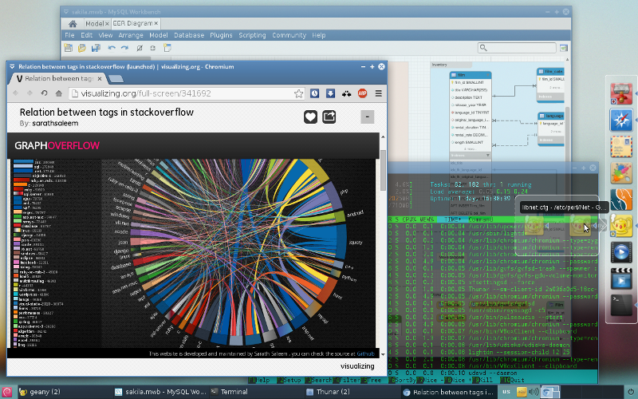

Bluebird Glx-Dock Theme
=======================================================================

Sometimes even little things can make a difference. With the Bluebird theme for Glx-Dock you can add a little punch to your professional *NIX desktop, that makes it even more useful and enjoyable.

#Table of contents

1. Introduction

2. Prerequisites

3. Install

4. Upgrade

5. Making changes

6. Contribute

7. Uninstall

8. Final words

9. Credits

10. Legal notices

#Introduction

Bluebird theme for Glx-Dock (aka Cairo-Dock) has been carefully designed to bridge the best of many worlds:

* The desktop clarity and simplicity offered by the Bluebird desktop theme

* The consistent and strong associations between functions and their graphical representations, polished by the Faenza icon theme

* The unobtrusive flexibility of Glx-Dock

and bring them together in a consistent manner.



Screenshot of an XFCE desktop with the Bluebird theme and Glx-Dock.

Of course, one could look at this README also from a completely different standpoint. You might be asking:

* Now that I have found a promising piece of software in that vast ocean of free open source, how do I take advantage of it?

* How do I keep that software updated, since it is not (ever going to be) included my OS updates?

* What will happen if this software project gets abandoned? Can I continue to get bug fixes and new features from somewhere else?

* Now that I have used and poked around that software a bit, I may have discovered and fixed few bugs, or even made some improvements. And if it is perfectly fine to keep all that for myself, how could I eventually share what I have achieved with friends, colleagues or the rest of the world?

* And ultimately, if the software happens to be not what I have been looking for, how can I safely get rid of it?

Clearly, questions like these have no simple answers. In fact, they reflect on complex topics like software development life cycle, asynchronous workflow, version control, systems integration etc., each covered extensively elsewhere.

This README however, looks at these questions as a whole and tries to provide some essential answers in a neat and simple (but in no way simplistic) manner. Therefore, one can think of this README as a short, hands-on, end-user survival guide to the world of open source.

#Prerequisites

To achieve the effect intended by the Bluebird Glx-Dock theme, you will need the following free software and artwork installed and configured:

- *NIX OS with a desktop environment

- Glx-Dock version 3.0.0 or newer: http://glx-dock.org/

- Bluebird desktop theme by the Shimmer Project: http://shimmerproject.org/project/bluebird/

- Faenza icon theme by thieum: http://tiheum.deviantart.com/art/Faenza-Icons-173323228

- (optionally) Faience Azur icon theme distributed with the Faience icon theme by thieum: http://tiheum.deviantart.com/art/Faience-icon-theme-255099649

- (optionally) Sapphire-turquoise gradient desktop wallpaper like: http://www.deviantart.com/morelikethis/304667728

- Git&trade; core client: http://git-scm.com/downloads

Probably most of the items referenced above are already available through your *NIX OS distribution channels. The URLs are provided for your convenience, whether you choose to look for any last-minute fixes and updates.

#Install

Once the prerequisites above are met, in order to install the Bluebird theme for Glx-Dock, execute the following statement in Terminal:

```
git clone https://github.com/bogomirov/glx-dock-bluebird-theme.git \
~/.config/cairo-dock/themes/Bluebird
```

Note that installing the theme does not immediately affect the appearance of Glx-Dock. In order to actually **use** the theme, you should apply it through the Glx-Dock Theme Manager.

#Upgrade

Once installed by completing the step above, the Bluebird Glx-Dock theme can be upgraded by executing the following statements in Terminal:

a) Switch to the folder where the Bluebird Glx-Dock theme is installed:

```
  cd ~/.config/cairo-dock/themes/Bluebird
```

b) Upgrade the theme with the latest changes from the GitGub repo:

```
  git pull origin master
```

Similarly, upgrading the theme this way does not immediately affect the appearance of Glx-Dock. In order to actually **use** the new version, you should re-apply the theme through the Glx-Dock Theme Manager.

#Making changes

Making changes to your local copy of the Bluebird theme for Glx-Dock is pretty straightforward. Just alter the appearance and behavior of Glx-Dock through its configuration panel and export the changes overwriting the Bluebird theme through the Theme Manager.

Now, there are two main issues to deal with here:

* When you make a change to a document, artwork or software configuration, it is natural to assume that any previous modifications you have made are lost, together with the work you have done and the time you have spent on them. The question here is, are these previous changes recoverable, and if so - is it possible to easily switch back and forth between them?

* Similarly, every time you upgrade your copy of the theme as described above, all changes you have implemented manually so far will be lost. Therefore, is there a way for a compromise? Could you somehow merge your changes with the changes coming from the original repository?

All these issues have their elegant solutions with just few keystrokes. Nothing can be lost, and you would never need to repeat work you have already done. Accomplishing this however requires deeper understanding of commits, branching and merging, which are subjects of version control beyond the scope of this README. For an extensive discussion on the topic, you can see the free on-line book about Git: http://git-scm.com/book

For the sake of simplicity however, you can always update your theme first and manually re-apply any previous changes afterwards.

#Contribute

Now that you have made modifications to your local copy of the theme, you might want to share them with the world. This would require dealing with the following issues:

* Deciding where the on-line copy of the locally modified theme will be hosted. This README assumes that you will use GitHub as an on-line provider, so you will need to open a free account with the service.

* Forking the original Bluebird Glx-Dock Theme repository to your GitHub account: https://help.github.com/articles/fork-a-repo#fork-an-example-repository

* Configuring your Git client to be able to send updates on-line: https://help.github.com/articles/set-up-git#setting-up-git

* Configuring your local copy of the Bluebird Glx-Dock Theme repository in a way that your modifications can be sent online, but still be able to incorporate updates as before. In order this to happen, you need to configure your fork as **origin**, and the original Bluebird Glx-Dock Theme repo as **upstream**. For details, see:

  * Synchung a fork: https://help.github.com/articles/fork-a-repo#step-3-configure-git-to-sync-your-fork-with-the-original-spoon-knife-repository

  * Renaming a remote: https://help.github.com/articles/renaming-a-remote

  * Adding a remote: https://help.github.com/articles/adding-a-remote

* From now on, you can publish online any changes you make: https://help.github.com/articles/pushing-to-a-remote

* A final and optional step could be to initiate a pull request, so your changes to the Bluebird theme for Glx-Dock can be incorporated in the original repository: https://help.github.com/articles/creating-a-pull-request

#Uninstall

To uninstall the Bluebird theme from the Glx-Dock Theme Manager, open Terminal and execute:

```
rm -rf ~/.config/cairo-dock/themes/Bluebird
```

Note that removing the theme from the Glx-Dock Theme Manager does not alter the current appearance of Glx-Dock. In order to accomplish that also, you should either select another theme, or alter the appearance/configuration of Glx-Dock manually.

Furthermore, removing the theme will **irrecoverably delete** the history of all modifications you have made. Therefore it is advisable to consider keeping an archive of your work elsewhere, e.g. by sharing it online.

#Final words

This README has been written having the general end-user in mind, and not only the software developer, as most of the version control guides do. That is why the workflow followed here is different. This README also looks at the big picture. Whether you have found other software you would like to try, you write a book, an article or produce other kinds of digital media, use other type of OS and version control system or collaborate on a closed-source project over the corporate intranet, the workflow you follow should be almost the same. Namely, one that aims achieving faster, better results easier.

For another project with similar concept and design, see the Dust theme for Glx-Dock: https://github.com/bogomirov/glx-dock-dust-theme

#Credits

This project utilizes code and/or artwork from the following sources:

* The Glx-Dock project: http://glx-dock.org/

* Faenza icon theme by thieum: http://tiheum.deviantart.com/art/Faenza-Icons-173323228

* Faience icon theme by thieum: http://tiheum.deviantart.com/art/Faience-icon-theme-255099649

* Faenza-Xfce icon theme by the Shimmer project: https://github.com/shimmerproject/Faenza-Xfce

* Geany icon for the Faenza theme by Colomban Wendling: https://github.com/b4n/geany-faenza-icon

* Xfce4.8 Panel BGs 1920x28 by kazu-spara: http://kazu-spara.deviantart.com/art/Xfce4-8-Panel-BGs-1920x28-267098524

#Legal notices

Git is a trademark of Software Freedom Conservancy, Inc.

Copyright on the project concept, theme design, the specific Glx-Dock configuration and some of the digital artwork &copy; 2014, Bogomir Bogomirov.

This theme is licensed under GPL version 3. See [LICENSE](LICENSE) file for details.
